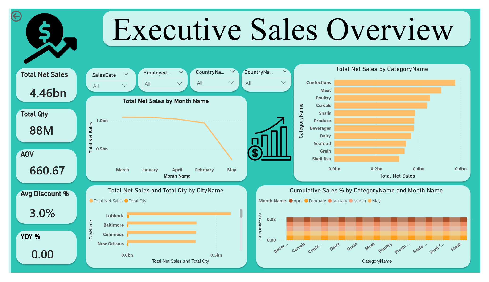
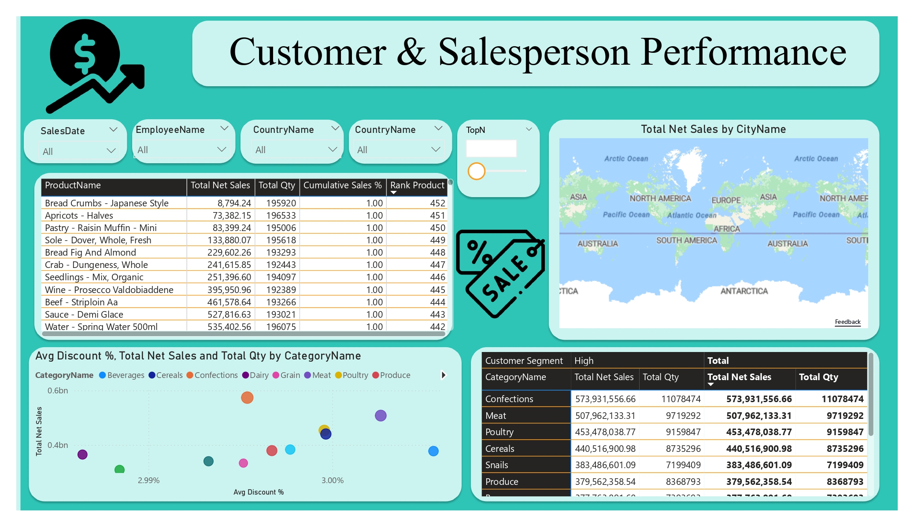

# 📊 Grocery Sales Dashboard

## 📌 Project Overview

This project presents a Power BI dashboard for analyzing grocery sales data. The goal is to evaluate sales performance, customer behavior, discount effectiveness, and regional trends to support business decision-making.

The solution includes two main dashboards:

* Executive Sales Overview
* Customer & Salesperson Performance

---
## 📸 Dashboard Preview

### 🔷 Page 1 – Executive Sales Overview

### 🔷 Page 2 – Customer & Salesperson Performance

---
## 🧱 Data Model

A **Single-Fact Star Schema** was implemented.

### Fact Table:

* sales

### Dimension Tables:

* products
* categories
* customers
* employees
* cities
* countries
* Date

Relationships are defined as **one-to-many (Dimension → Fact)**.

---

## 📅 Date Table

A custom Date table was created using DAX to enable time-based analysis (monthly trends, YoY, etc.).

---

## 📐 Key Measures

* Total Net Sales
* Total Quantity
* Average Order Value (AOV)
* Average Discount %
* Sales Previous Year (Sales PY)
* Year-over-Year % (YoY %)
* Net vs Gross Gap
* Product Ranking

---

## 📊 Dashboards

### 🔷 Page 1 – Executive Overview

* KPI Cards (Sales, Quantity, AOV, Discount %, YoY)
* Line chart: Net Sales by Month
* Bar chart: Net Sales by Category (drill-down to Product)
* Clustered bar chart: Net Sales and Quantity by Country
* Stacked/Ribbon chart: Category Contribution over time
* Slicers: Date, Country, Category, Salesperson

---

### 🔷 Page 2 – Customer & Salesperson Performance

* Matrix: Customer Segment × Category (Net Sales & Quantity)
* Scatter chart: Salesperson performance (Discount vs Sales)
* Top N Products table with ranking
* Map: Net Sales by City
* Slicers: Date, Country, Category, Salesperson

---

## 📈 Key Insights

* Top-performing categories include Confections, Meat, and Poultry.
* Sales trends fluctuate over time with noticeable variations in recent periods.
* Moderate discounts (~3%) are effective in driving higher sales volume.
* Repeat customers (2+ orders) contribute significantly to total revenue.
* Sales performance is concentrated among a small group of salespeople.
* Some cities achieve high sales without heavy discounting, indicating strong demand.

---

## 🎯 Conclusion

The dashboard provides valuable insights into sales performance, customer behavior, and discount strategies. It enables data-driven decision-making to improve profitability, optimize pricing strategies, and focus on high-performing categories and customers.

---

## 🛠 Tools Used

* Power BI Desktop
* DAX (Data Analysis Expressions)
* Power Query

---

## 👨‍💻 Author

Grocery Sales BI Project  
Prepared as part of coursework assignment.
Abdelrhman Aj
